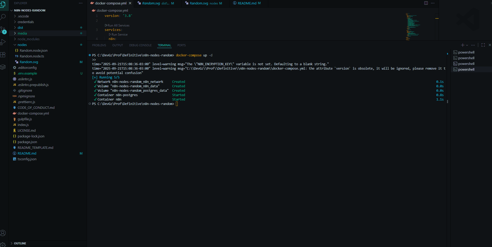
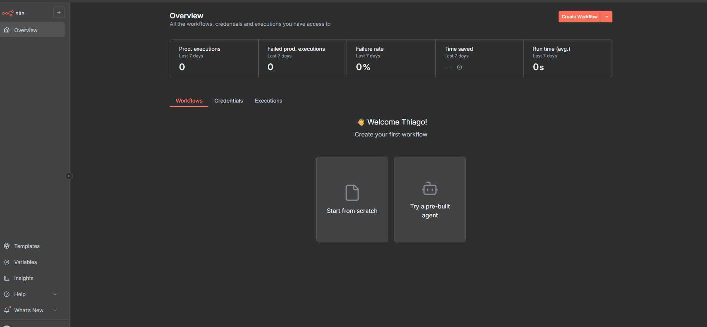
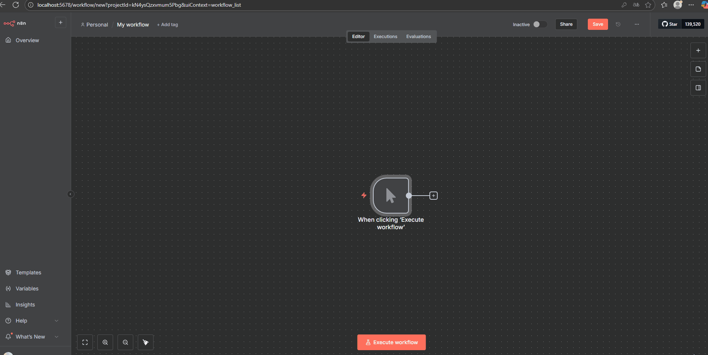
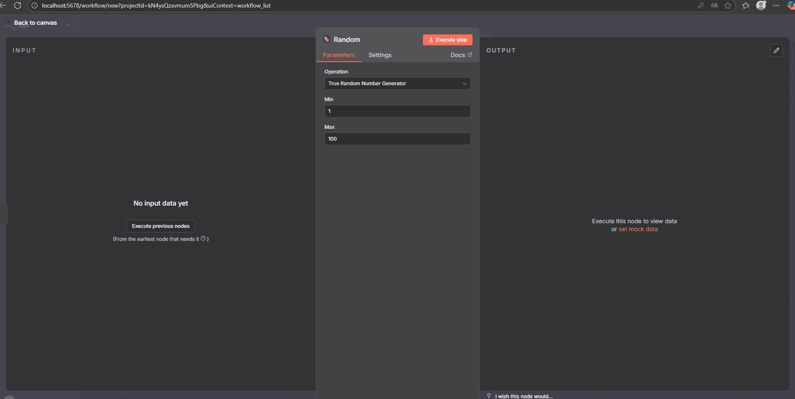

# n8n-nodes-random

Este repositório contém um conector personalizado para n8n chamado Random.

O conector possui uma única operação: **"True Random Number Generator"**, que recebe dois parâmetros (`Min` e `Max`) e retorna um número aleatório utilizando a API do Random.org

O objetivo deste projeto é demonstrar como criar nodes customizados no n8n usando TypeScript, integrando APIs externas, e rodando em uma instância local de n8n via Docker com PostgreSQL.

A infraestrutura local foi configurada para permitir que o n8n rode de forma isolada e replicável, garantindo que os testes do conector possam ser feitos em qualquer máquina sem depender de instalações globais adicionais.

O projeto inclui:

1. Node customizado (`Random`) pronto para ser linkado no n8n, organizado na pasta `nodes`.
2. Configuração do Docker Compose para subir o **n8n + PostgreSQL**.
3. `README` detalhado com instruções para instalar dependências, configurar o ambiente, executar testes e rodar o n8n localmente.
4. Para facilitar o entendimento do funcionamento do conector Random, incluímos exemplos visuais na pasta `media`.

O objetivo deste projeto é demonstrar a criação de nodes customizados no n8n, com TypeScript, Docker e integração com APIs externas.

---

## Pré-requisitos

Para rodar este projeto localmente, você precisará ter instalado:

* [git](https://git-scm.com/downloads)
* [Node.js](https://nodejs.org/) (versão 22 LTS ou superior)
* [npm](https://www.npmjs.com/)
* [Docker](https://docs.docker.com/get-docker/)

---

## Configuração e execução

### 1. Clonar o repositório
```bash
git clone https://github.com/ThiagoPerdigao/random.git
cd random
```

### 2. Instalar dependências

Instala todas as dependências necessárias para compilar o código e rodar os scripts.

```bash
npm install
```

### 3. Gerar build

O build compila o TypeScript e copia os ícones SVG para a pasta `dist`:

```bash
npm install
```
* Sempre execute este comando após modificar arquivos TypeScript ou SVG para garantir que o node esteja atualizado no n8n.

### 4. Configurar variáveis de ambiente

Crie o arquivo `.env` baseado no `.env.example`:

```bash
cp .env.example .env
```


### 5. Subir a infraestrutura com Docker

O `docker-compose.yml` cria containers para:
1. n8n (instância local self-hosted)
2. PostgreSQL (banco de dados do n8n)

```bash
docker-compose up -d
```

Acesse a instância do n8n em: `http://localhost:5678`

---

## Testando o conector

Este teste permite validar se o node `Random` está funcionando corretamente, gerando números aleatórios dentro do intervalo definido pelos parâmetros `Min` e `Max`, utilizando a API do [Random.org](https://www.random.org/integers/).  
Ele também garante que o node esteja integrado corretamente à interface do n8n e que os ícones e parâmetros estejam sendo exibidos corretamente.

## Testando o conector

Esta seção mostra passo a passo como testar o node `Random` no n8n, incluindo imagens animadas para ajudar na execução.

---

##### 1. Acesse a instância do n8n



Na primeira vez que você acessar, será necessário fazer um **cadastro**.  
Nas próximas visitas, basta **realizar login** ou você será redirecionado diretamente para a **home page** do n8n.

---

##### 2. Crie um novo workflow



Clique em **Create Workflow** e selecione o **evento de disparo** desejado para iniciar o workflow.

---

##### 3. Adicione o node `Random` ao workflow



Clique no **+** à direita do evento, abra a aba de busca de nodes e pesquise pelo nosso node customizado **`Random`**, identificado pelo **ícone dos dados amarelos**.

---

##### 4. Configure os parâmetros Min e Max e execute o workflow



Preencha os inputs **Min** e **Max** com valores inteiros.  
Clique em **Execute Steps** para rodar o workflow e verificar se o node retorna um número aleatório usando a API do Random.org.

---

## Observações

- Todos os arquivos TypeScript foram compilados para `dist/` e podem ser utilizados pelo n8n.
- As descrições dos parâmetros foram escritas para facilitar a experiência do usuário.
- Foram seguidas as boas práticas recomendadas pela documentação oficial do n8n.
- A infraestrutura Docker garante que o projeto seja executável em qualquer máquina sem instalação global do n8n.


## Estrutura desenvolvida

Este projeto foi iniciado a partir do repositório oficial [n8n-io/n8n-nodes-starter](https://github.com/n8n-io/n8n-nodes-starter) como base para criar nós customizados no n8n.  
Para preservar o que já existia no clone original, não foram removidos arquivos desnecessários do starter, mantendo a estrutura inicial intacta enquanto adicionamos nosso conector Random.

A estrutura do que foi desenvolvido especificamente é a seguinte:

``` n8n-nodes-random/
├── credentials/              // Não se deu necessária pela baixa complexidade
├── nodes/
│ ├── Random.node.ts          // implementação do node
│ ├── Random.node.json        // metadata do node
│ └── random_v2.svg           //ícone do node
├── media/                   // imagens e gifs para o README
├── gulpfile.js              // Foram realizadas melhorias
├── package.json
├── tsconfig.json
├── docker-compose.yml
└── README.md 
```
